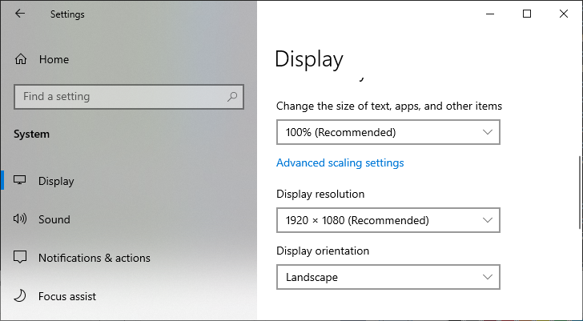

  <h1>Windows Interface Wrapper</h1>
  
This project wraps some common Windows api

  

    I hope it can help you~
    See the table of contents for specific functions, and refer to the relevant usage<a href="./Test">Test the code of the directory</a>
  

  

    <h3>English&emsp;|&emsp;<a href="./README_zh-CN.md">简体中文</a></h3>
  

  

    
  

## Function Introduction

- [Registry Operations](#Registry Operations)
- [System Display Infomation](#System Display Infomation)

## Registry Operations

- [Registry Search](./Src/WinReg/WinRegUtil.h "WinRegUtil")
- [Registry Modification](./Src/WinReg/WinRegUtil.h "WinRegUtil")
- [System boot, program self-start](./Src/WinReg/WinRegUtil.h. "WinRegUtil")

## System Display Infomation

- [Scale and layout](./Src/WinSystemInfo/WinSystemDisplayInfoUtil.h "WinSystemDisplayInfoUtil")
- [Display resolution](./Src/WinSystemInfo/WinSystemDisplayInfoUtil.h "WinSystemDisplayInfoUtil")
- [Display orientation](./Src/WinSystemInfo/WinSystemDisplayInfoUtil.h "WinSystemDisplayInfoUtil")
